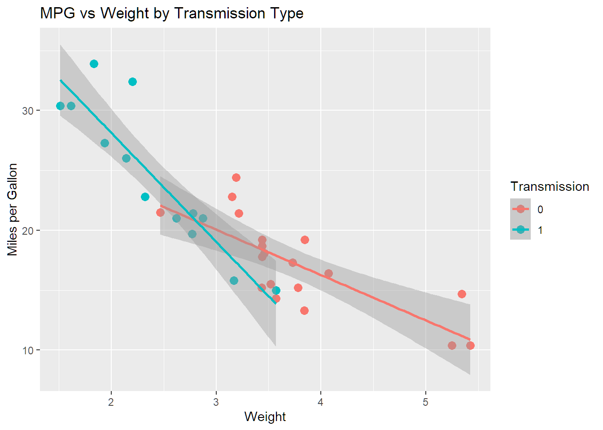

# 📊 Regression Models Project

👤 Author: Ruel Laranjo  
🎯 Role: Aspiring Data Scientist  

---

## 📌 Project Overview
This project analyzes whether transmission type (manual vs automatic) has a significant impact on fuel efficiency (miles per gallon, MPG).

Using the mtcars dataset, linear regression models were applied to understand the relationship between transmission type and MPG.

---

## 🔍 Key Insights
- Manual cars tend to have higher MPG than automatic cars.
- When weight and horsepower are included, transmission effect becomes less significant.
- Vehicle weight has a strong negative impact on fuel efficiency.

---

## 📈 Methods Used
- Linear Regression
- Multiple Regression
- Data Visualization (ggplot2)
- Model Diagnostics

---

## 📂 Files
- `regression_project.Rmd` → Source code
- `regression_project.html` → Final report

---
## 📊 Visualization

This plot shows the relationship between vehicle weight and fuel efficiency (MPG), grouped by transmission type.

---

## 🚀 Conclusion
This project shows how regression models help identify key factors affecting performance and support data-driven decisions.

---

## 🔗 View Project
📄 [View Full Report (HTML)](regression_project.html)
💻 [View Source Code on GitHub](https://github.com/ruelblaranjo28-cloud/regression-models-r)

